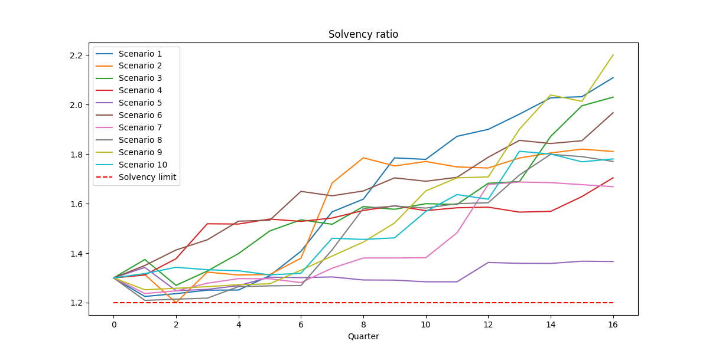

# Optimal Asset Allocation under Solvency Regulation

This project finds the optimal asset allocation for equities and bonds while adhering to the Finnish solvency regulations.

We start by simulating asset return paths for equities using Geometric Brownian Motion and for bonds using the Cox-Ingersoll-Ross (CIR) model.

After the simulation, a stochastic optimization model aims to find the optimal asset allocation while staying above a solvency limit.

## Features
- Asset return path simulation using Geometric Brownian Motion for equities
- Asset return path simulation using Cox-Ingersoll-Ross (CIR) model for bonds
- Stochastic optimization model for optimal asset allocation
- Compliance with Finnish solvency regulations

## How to Run
1. Clone this repository.
2. Install the dependencies: `pip install -r requirements.txt`.
3. Run `python main.py`.